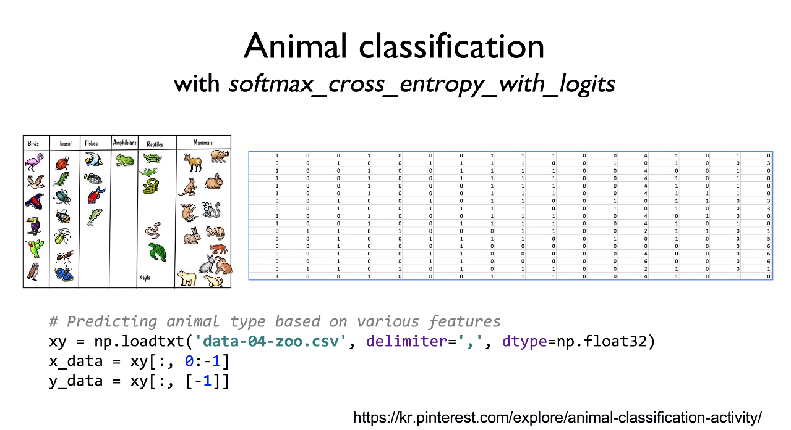
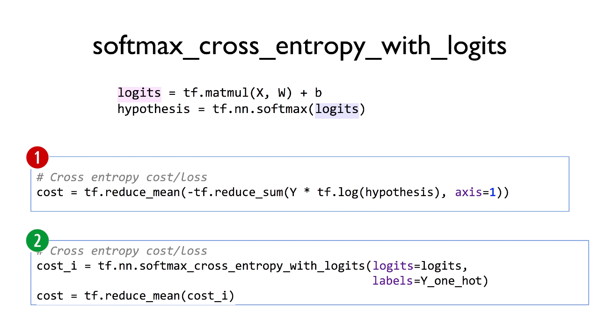

# Implement Fancy Softmax Classification with TensorFlow]

## Import Data from Local .cvs File

    
    import numpy as np
    
    tf.set_random_seed(777)  # for reproducibility
    
    # Predicting animal type based on various features
    xy = np.loadtxt('./data-04-zoo.csv', delimiter=',', dtype=np.float32)
    x_data = xy[:, 0:-1]
    y_data = xy[:, [-1]]
    
    print(x_data.shape, y_data.shape)

[return]

(101, 16) (101, 1)

## Reshpe One_Hot

    import tensorflow as tf
    
    nb_classes = 7  # 0 ~ 6

    X = tf.placeholder(tf.float32, [None, 16])
    Y = tf.placeholder(tf.int32, [None, 1])  # 0 ~ 6
    
    # If the input indices is rank N, the output will have rank N+1
    # The new axis is created at dimension axis (default: the new axis is appended at the end)
    # [[0], [3]] => [[[10000000], [[0010000]]]
    Y_one_hot = tf.one_hot(Y, nb_classes)  # one hot
    print("one_hot:", Y_one_hot)
    
    # reshape: (?, 1, 7) => (?, 7)
    # [-1(=Everything), nb_classes(=7)] (change that new form)
    Y_one_hot = tf.reshape(Y_one_hot, [-1, nb_classes])
    print("reshape one_hot:", Y_one_hot)
    
[return]

one_hot: Tensor("one_hot:0", shape=(?, 1, 7), dtype=float32)

reshape one_hot: Tensor("Reshape:0", shape=(?, 7), dtype=float32)

## Classification

    
    W = tf.Variable(tf.random_normal([16, nb_classes]), name='weight')
    b = tf.Variable(tf.random_normal([nb_classes]), name='bias')

    # tf.nn.softmax computes softmax activations
    # softmax = exp(logits) / reduce_sum(exp(logits), dim)
    logits = tf.matmul(X, W) + b
    hypothesis = tf.nn.softmax(logits)

    # Cross entropy cost/loss
    # logit과 Y(Y_one_hot)을 parameter로 제공하면 알아서 cross entropy를 통해 cost 계산함
    cost = tf.reduce_mean(tf.nn.softmax_cross_entropy_with_logits_v2(logits=logits,
                                                                     labels=tf.stop_gradient([Y_one_hot])))
    optimizer = tf.train.GradientDescentOptimizer(learning_rate=0.1).minimize(cost)

    prediction = tf.argmax(hypothesis, 1)
    correct_prediction = tf.equal(prediction, tf.argmax(Y_one_hot, 1))
    accuracy = tf.reduce_mean(tf.cast(correct_prediction, tf.float32))

    # Launch graph
    with tf.Session() as sess:
        sess.run(tf.global_variables_initializer())

        for step in range(2001):
            _, cost_val, acc_val = sess.run([optimizer, cost, accuracy], feed_dict={X: x_data, Y: y_data})

            if step % 100 == 0:
                print("Step: {:5}\tCost: {:.3f}\tAcc: {:.2%}".format(step, cost_val, acc_val))

        # Let's see if we can predict
        pred = sess.run(prediction, feed_dict={X: x_data})
        for p, y in zip(pred, y_data.flatten()):
            print("[{}] prediction: {} True Y: {}:".format(p == int(y), p, int(y))) 

[return]

Step:     0	Cost: 5.480	Acc: 37.62%

Step:   100	Cost: 0.806	Acc: 79.21%

Step:   200	Cost: 0.488	Acc: 88.12%

. . .

Step:  1800	Cost: 0.060	Acc: 100.00%

Step:  1900	Cost: 0.057	Acc: 100.00%

Step:  2000	Cost: 0.054	Acc: 100.00%

[True] prediction: 0 True Y: 0:

[True] prediction: 0 True Y: 0:

[True] prediction: 3 True Y: 3:

. . .

[True] prediction: 0 True Y: 0:

[True] prediction: 6 True Y: 6:

[True] prediction: 1 True Y: 1: