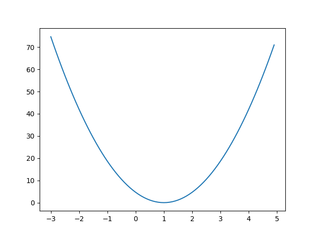

# Lab03. Minimize cost of Linear Regression - (1)

    import tensorflow as tf
    import matplotlib.pyplot as plt

    X = [1, 2, 3]
    Y = [1, 2, 3]

    # in this simple case, there is no bias
    W = tf.placeholder(tf.float32)

    # Our hypothesis for linear model X * W
    hypothesis = X * W

    # cost / loss function
    cost = tf.reduce_mean(tf.square(hypothesis - Y))

    # Launch the graph in a session
    sess = tf.Session()

    # Initializes global variables in the graph
    sess.run(tf.global_variables_initializer())

    # Variables for plotting cost function
    W_val = []
    cost_val = []
    
    # append(<parameter>): 하나의 <parameter> object를 맨 뒤에 추가
    for i in range(-30, 50):
        feed_W = i * 0.1
        curr_cost, curr_W = sess.run([cost, W], feed_dict={W: feed_W})
        W_val.append(curr_W)
        cost_val.append(curr_cost)

    # Show the cost function
    plt.plot(W_val, cost_val)
    plt.show()
    
[return]

