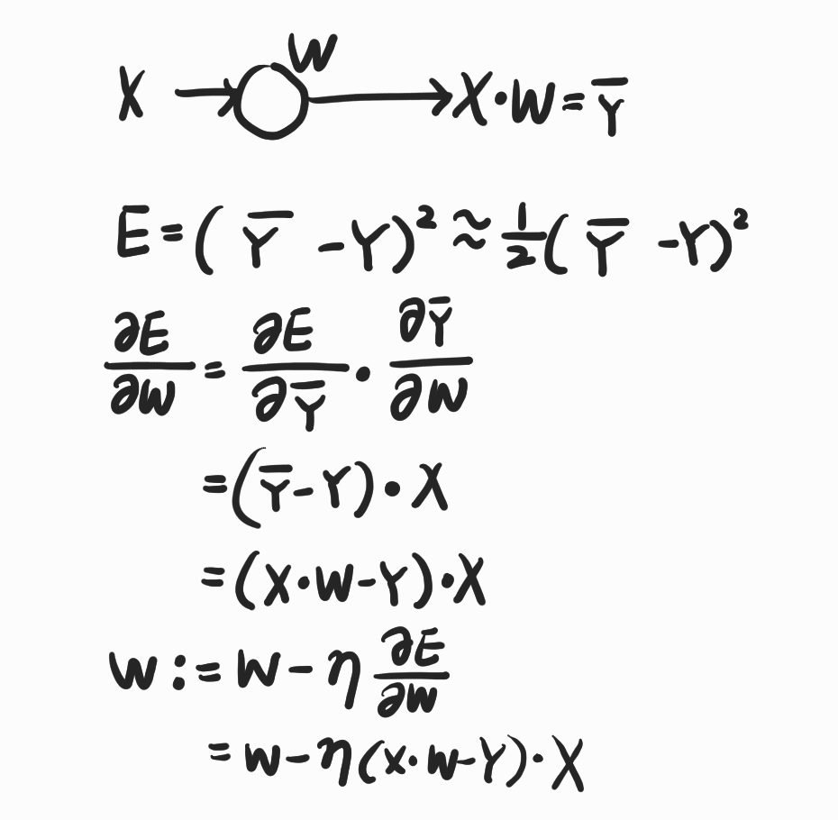

# Lab03. Minimize cost of Linear Regression - (2)

    import tensorflow as tf

    x_data = [1, 2, 3]
    y_data = [1, 2, 3]

    W = tf.Variable(tf.random_normal([1]), name='weight')
    X = tf.placeholder(tf.float32)
    Y = tf.placeholder(tf.float32)

    # Our hypothesis for linear model X * W
    hypothesis = X * W

    # cost/loss function
    cost = tf.reduce_sum(tf.square(hypothesis - Y))

    # Minimize: Gradient Descent using derivative: W -= Learning_rate * derivative
    # derivative: cost function의 미분 <= 1/m((W * X - Y) * X)
    # assign(<parameter>): 대입 연산
    learning_rate = 0.1
    gradient = tf.reduce_mean((W * X - Y) * X)
    descent = W - learning_rate * gradient
    update = W.assign(descent)

    # Launch the graph in a session
    sess = tf.Session()

    # Initializes global variables in the graph
    sess.run(tf.global_variables_initializer())

    for step in range(21):
        sess.run(update, feed_dict={X: x_data, Y: y_data})
        print(step, sess.run(cost, feed_dict={X: x_data, Y: y_data}), sess.run(W))
    
[return]

0 0.3151813 [1.1500431]

1 0.089651644 [1.080023]

2 0.025500933 [1.042679]

. . .

18 4.3499426e-11 [1.0000018]

19 1.2732926e-11 [1.000001]

20 3.1832315e-12 [1.0000005]
