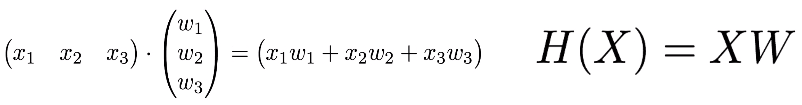

# Lab04-1. Implement Multi-Variable Linear Regression with TensorFlow - (2)

    import tensorflow as tf

    tf.set_random_seed(777)  # for reproducibility

    # using matrix
    x_data = [[73., 80., 75.],
              [93., 88., 93.],
              [89., 91., 90.],
              [96., 98., 100.],
              [73., 66., 70.]]

    y_data = [[152.],
              [185.],
              [180.],
              [196.],
              [142.]]

    # placeholders for a tensor that will be always fed
    X = tf.placeholder(tf.float32, shape=[None, 3])
    Y = tf.placeholder(tf.float32, shape=[None, 1])

    W = tf.Variable(tf.random_normal([3, 1]), name='weight1')
    b = tf.Variable(tf.random_normal([1]), name='bias')

    # tf.matmul(<parameters>): <parameter>의 matrix를 곱한다
    hypothesis = tf.matmul(X, W) + b

    # cost/loss function
    cost = tf.reduce_mean(tf.square(hypothesis - Y))

    # Minimize. Need a very small learning rate for this data set
    optimizer = tf.train.GradientDescentOptimizer(learning_rate=1e-5)
    train = optimizer.minimize(cost)

    # Launch the graph is a session
    sess = tf.Session()
    # Initializes global variables in the graph
    sess.run(tf.global_variables_initializer())

    for step in range(2001):
        cost_val, hy_val, _ = sess.run([cost, hypothesis, train], feed_dict={X: x_data, Y: y_data})
        if step % 10 == 0:
            print(step, "Cost:", cost_val, "\nPrediction:\n", hy_val)

[return]

0 Cost: 22655.951 

Prediction:

 [[22.048063]

 [21.619787]

 [24.096693]

 [22.293005]

 [18.633902]]

10 Cost: 6.041753 

Prediction:

 [[155.17455]

 [181.64264]

 [181.76219]

 [193.98837]

 [140.6934 ]]

20 Cost: 5.813164 

Prediction:

 [[155.56952]

 [182.1321 ]

 [182.23676]

 [194.50674]

 [141.06909]]
 
. . .

1980 Cost: 3.1944592 

Prediction:

 [[154.36868]

 [182.94485]

 [181.85355]

 [194.35635]

 [142.02844]]

1990 Cost: 3.1866612 

Prediction:

 [[154.36398]

 [182.94801]

 [181.85204]

 [194.35587]

 [142.03204]]

2000 Cost: 3.178877 

Prediction:

 [[154.3593 ]

 [182.95117]

 [181.85052]

 [194.35541]

 [142.03566]]
