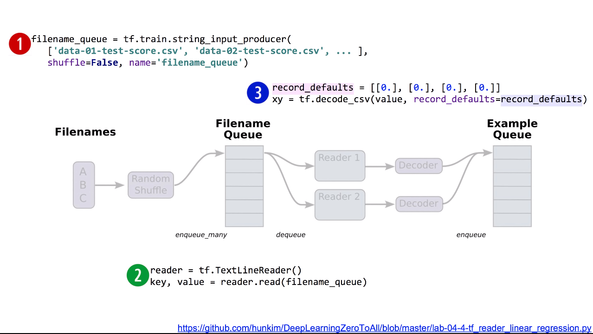

# Lab04-2. Loading Data From File with TensorFlow - (2)

## Filename Queue

    import tensorflow as tf

    tf.set_random_seed(777)  # for reproducibility

    # 여러 file 이름을 list화
    filename_queue = tf.train.string_input_producer(['data-01-test-score.csv'],
                                                shuffle=False, name='filename_queue')

    # file 이름을 읽어올 리더를 만듦
    # key와 value로 나누어 읽음
    reader = tf.TextLineReader()
    key, value = reader.read(filename_queue)

    # value를 어떻게 파싱할 것인가
    # record_defaults를 통해 값의 형태를 미리 지정할 수 있음
    # Default values, in case of empty colums. Also specifies the type of the decoded result,.
    record_defaults = [[0.], [0.], [0.], [0.]]
    xy = tf.decode_csv(value, record_defaults=record_defaults)

    # batch를 통해 데이터를 추출할 수 있음(일종의 펌프 역할)
    # 한 펌프당 10개의 데이터를 동시에 가져오게 됨
    # collect batches of csv in
    train_x_batch, train_y_batch = tf.train.batch([xy[0:-1], xy[-1:]], batch_size=10)

## Training Linear Regression Using Filename Queue

    # placeholders for a tensor that will be always fed
    X = tf.placeholder(tf.float32, shape=[None, 3])
    Y = tf.placeholder(tf.float32, shape=[None, 1])

    W = tf.Variable(tf.random_normal([3, 1]), name='weight')
    b = tf.Variable(tf.random_normal([1]), name='bias')

    # Hypothesis
    hypothesis = tf.matmul(X, W) + b

    # Simplified cost/loss function
    cost = tf.reduce_mean(tf.square(hypothesis - Y))

    # Minimize
    optimizer = tf.train.GradientDescentOptimizer(learning_rate=1e-5)
    train = optimizer.minimize(cost)

    # Launch the graph in a session
    sess = tf.Session()
    # Initializes global variables in the graph
    sess.run(tf.global_variables_initializer())

    # Start populating the filename queue
    coord = tf.train.Coordinator()
    threads = tf.train.start_queue_runners(sess=sess, coord=coord)

    # train_x_batch, train_y_batch 역시 tensor이므로 매 루프마다 실행시킴
    for step in range(2001):
        x_batch, y_batch = sess.run([train_x_batch, train_y_batch])
        cost_val, hy_val, _ = sess.run(
            [cost, hypothesis, train], feed_dict={X: x_batch, Y: y_batch})
        if step % 10 == 0:
            print(step, "Cost:", cost_val, "\nPrediction:\n", hy_val)

    coord.request_stop()
    coord.join(threads)

[return]

0 Cost: 7070.9795 

Prediction:

 [[235.22784]
 
 [282.40146]
 
 [278.39618]
 
. . .

 [170.92644]
 
 [264.65048]
 
 [246.59116]]
 
10 Cost: 5.577785 

Prediction:

 [[154.65848]
 
 [185.555  ]
 
 [182.97673]
 
. . .

 [113.26346]
 
 [174.13757]
 
 [162.75192]]
 
20 Cost: 4.62937 

Prediction:

 [[154.11101 ]
 
 [184.90294 ]
 
 [182.33101 ]
 
. . .

 [112.87885 ]
 
 [173.53265 ]
 
 [162.19771 ]]
 
. . .

1980 Cost: 4.22898 

Prediction:

 [[153.63814 ]
 
 [185.0735  ]
 
 [182.09114 ]
 
. . .

 [113.514984]

 [174.271   ]
 
 [163.68524 ]]
 
1990 Cost: 4.229026 

Prediction:

 [[153.63675]
 
 [185.07394]
 
 [182.0904 ]
 
. . .

 [113.51724]
 
 [174.27321]
 
 [163.68988]]
 
2000 Cost: 4.229059 

Prediction:

 [[153.63536 ]
 
 [185.07439 ]
 
 [182.08965 ]
 
. . .

 [113.519485]
 
 [174.27542 ]
 
 [163.69449 ]]