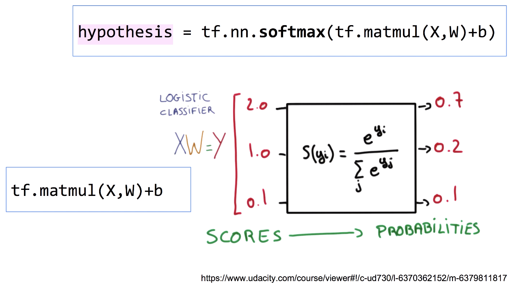
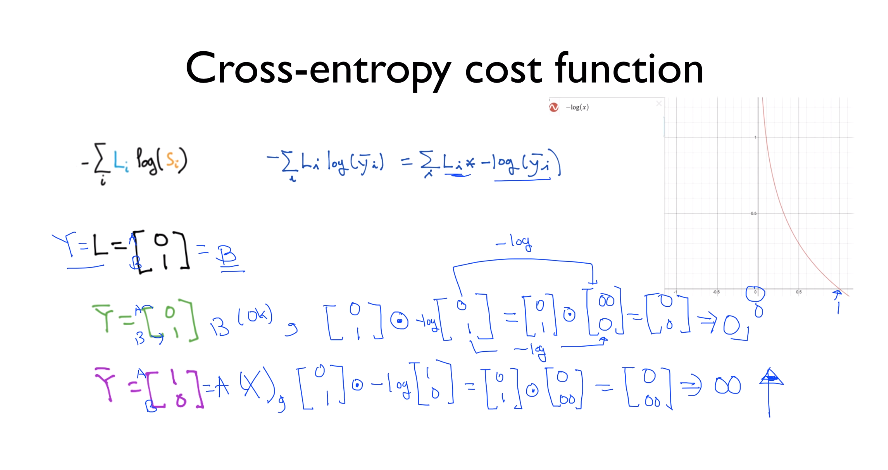
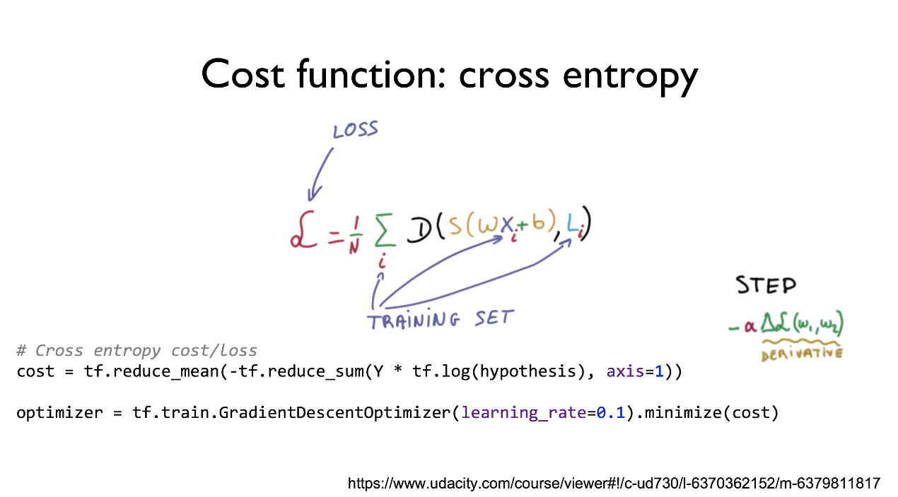

#Lab06-1. Implement Softmax Classification with TensorFlow

    import tensorflow as tf
    
    tf.set_random_seed(777)  # for reproducibility
    
    x_data = [[1, 2, 1, 1],
              [2, 1, 3, 2],
              [3, 1, 3, 4],
              [4, 1, 5, 5],
              [1, 7, 5, 5],
              [1, 2, 5, 6],
              [1, 6, 6, 6],
              [1, 7, 7, 7]]
    
    # one-hot encoding matrix
    # 세 개의 클래스 중 어느 클래스에 속하는지를 표시
    y_data = [[0, 0, 1],
              [0, 0, 1],
              [0, 0, 1],
              [0, 1, 0],
              [0, 1, 0],
              [0, 1, 0],
              [1, 0, 0],
              [1, 0, 0]]
    
    
    # nb_classes: label(class)의 개수
    X = tf.placeholder(tf.float32, shape=[None, 4])
    Y = tf.placeholder(tf.float32, shape=[None, 3])
    nb_classes = 3
    
    # tf.random_normal([x:y]): x - x의 개수, y - 출력의 개수
    W = tf.Variable(tf.random_normal([4, nb_classes]), name='weight')
    b = tf.Variable(tf.random_normal([nb_classes]), name='bias')
    
    # tf.nn.softmax computes softmax activations
    # softmax = exp(logits) / reduce_sum(exp(logits), dim)
    hypothesis = tf.nn.softmax(tf.matmul(X, W) + b)
    
    # Cross Entropy cost/loss
    # axis: 0 - 세로축을 기준으로 연산, 1 - 가로축을 기준으로 연산
    cost = tf.reduce_mean(-tf.reduce_sum(Y * tf.log(hypothesis), axis=1))
    
    optimizer = tf.train.GradientDescentOptimizer(learning_rate=0.1).minimize(cost)
    
    # Launch graph
    with tf.Session() as sess:
        sess.run(tf.global_variables_initializer())
    
        for step in range(2001):
            _, cost_val = sess.run([optimizer, cost], feed_dict={X: x_data, Y: y_data})
    
            if step % 200 == 0:
                print(step, cost_val)
    
        print('------------------------')
        # Testing & One-hot encoding
        # tf.argmax(<matrix>, <flag>): 해당 <matrix>에서 어떠한 기준으로 max값의 위치 찾기
        # 2차원 배열의 경우, flag는 0과 1이 될 수 있음
        # 0인 경우, 열 기준으로 찾기  (위 아래 비교, 왼쪽에서 오른쪽으로 이동)
        # 1인 경우, 행 기준으로 찾기  (왼쪽 오른쪽 비교, 위에서 아래로 이동)
        # 단, 행 기준으로 찾고 있을 때 행이 1개인 경우 출력 결과가 1개임
        a = sess.run(hypothesis, feed_dict={X: [[1, 11, 7, 9]]})
        print(a, sess.run(tf.argmax(a, 1)))
    
        print('------------------------')
        b = sess.run(hypothesis, feed_dict={X: [[1, 3, 4, 3]]})
        print(b, sess.run(tf.argmax(b, 1)))
    
        print('------------------------')
        c = sess.run(hypothesis, feed_dict={X: [[1, 1, 0, 1]]})
        print(c, sess.run(tf.argmax(c, 1)))
    
        print('------------------------')
        all = sess.run(hypothesis, feed_dict={X: [[1, 11, 7, 9], [1, 3, 4, 3], [1, 1, 0, 1]]})
        print(all, sess.run(tf.argmax(all, 1)))
        
[return]

0 6.926112

200 0.60050154

400 0.47295848

600 0.37342918

800 0.28018343

1000 0.23280503

1200 0.21065342

1400 0.19229883

1600 0.1768233

1800 0.16359562

2000 0.15216148

------------------------

[[1.3890496e-03 9.9860185e-01 9.0612912e-06]] [1]

------------------------

[[0.93119204 0.06290206 0.0059059 ]] [0]

------------------------

[[1.2732767e-08 3.3411290e-04 9.9966586e-01]] [2]

------------------------

[[1.3890496e-03 9.9860185e-01 9.0612912e-06]

 [9.3119204e-01 6.2902056e-02 5.9058950e-03]
 
 [1.2732767e-08 3.3411290e-04 9.9966586e-01]] [1 0 2]