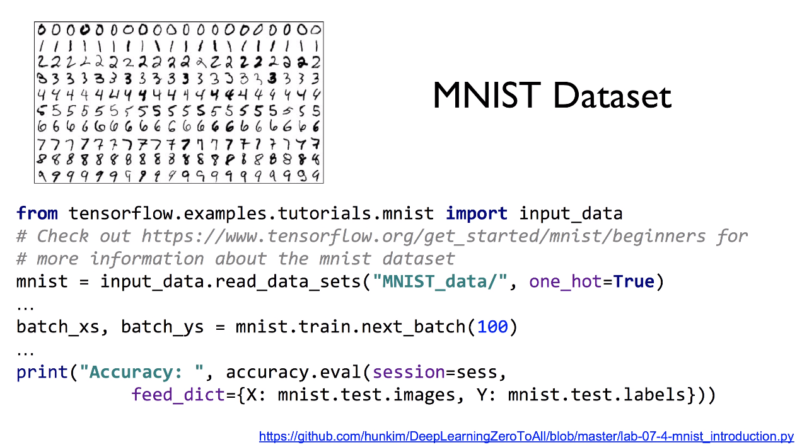
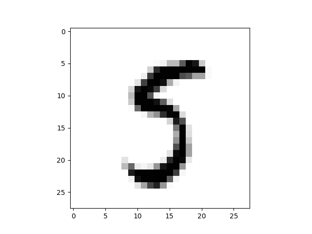

#Lab07-2. Meet MNIST Data

    import tensorflow as tf
    import matplotlib.pyplot as plt
    import random
    
    tf.set_random_seed(777)  # for reproducibility
    
    from tensorflow.examples.tutorials.mnist import input_data
    
    # Check out https://www.tensor-flow.org/get_started/mnist/beginners for
    # more information about the mnist dataset
    # Download and Read data sets
    # one_hot=True: 읽어올 때 별도의 처리 없이 one_hot 형태로 불러옴
    mnist = input_data.read_data_sets("MNIST_data/", one_hot=True)
    
    # 0 - 9, total 10
    nb_classes = 10
    
    # MNIST data image of shape 28 * 28 = 784
    X = tf.placeholder(tf.float32, [None, 784])
    # 0 - 9 digits recognition = 10 classes
    Y = tf.placeholder(tf.float32, [None, nb_classes])
    
    W = tf.Variable(tf.random_normal([784, nb_classes]))
    b = tf.Variable(tf.random_normal([nb_classes]))
    
    # Hypothesis (using softmax)
    hypothesis = tf.nn.softmax(tf.matmul(X, W) + b)
    
    cost = tf.reduce_mean(-tf.reduce_sum(Y * tf.log(hypothesis), axis=1))
    train = tf.train.GradientDescentOptimizer(learning_rate=0.1).minimize(cost)
    
    # Test model
    is_correct = tf.equal(tf.argmax(hypothesis, 1), tf.argmax(Y, 1))
    # Calculate accuracy
    accuracy = tf.reduce_mean(tf.cast(is_correct, tf.float32))
    
    # parameters
    # epoch: one epoch is one forward pass and one backward pass of all the training example
    #        한 번의 epoch는 모든 데이터를 가지고 한 번의 훈련을(한 번의 forward와 한 번의 backward를) 수행시키는 것을 뜻함
    # batch_ size: the number of training examples in one forward/backward pass.
    #              The higher the patch size, the more memory space you'll need.
    #              한 번의 forward/backward pass 동안 트레이닝 시킬 예제의 수
    # iteration: The number of iterations is number of passes, each pass using [batch size] number of examples.
    #            To be clear, one pass = one forward pass + one backward pass
    #            (we do not count the forward pass and backward pass as two different passes)
    #            iteration의 수는 pass(batch size 만큼의 forward + backward)의 수를 뜻함
    # if all data = 1000 and batch_size = 100, 1 epoch = 10 iteration
    num_epochs = 15
    batch_size = 100
    num_iterations = int(mnist.train.num_examples / batch_size)
    
    with tf.Session() as sess:
        # Initialize TensorFlow variables
        sess.run(tf.global_variables_initializer())
        # Training cycle (15번)
        for epoch in range(num_epochs):
            avg_cost = 0
    
            # 전체 데이터 셋을 batch_size 만큼의 덩어리로 나누어 수행
            for i in range(num_iterations):
                # batch_size 만큼의 x와 y 데이터를 가져옴
                batch_xs, batch_ys = mnist.train.next_batch(batch_size)
                _, cost_val = sess.run([train, cost], feed_dict={X: batch_xs, Y: batch_ys})
                # iteration 수만큼을 나눈 cost 값을 누적하여 한 epoch 당 평균 cost 값을 구함
                avg_cost += cost_val / num_iterations
    
            print("Epoch: {:04d}, Cost: {:.9f}".format(epoch + 1, avg_cost))
    
        print("Learning finished")
    
        # Test the model using test sets
        # sess.run(accuracy) == accuracy.eval(session=sess)
        print(
            "Accuracy:",
            accuracy.eval(
                # mnist.test: 학습에 쓰이지 않는 test sets
                session=sess, feed_dict={X: mnist.test.images, Y: mnist.test.labels}
            ),
        )
    
        # Get one and predict
        # random.randint(<minimum>, <maximum>): minimum ~ maximum 중 임의의 정수 리턴
        r = random.randint(0, mnist.test.num_examples - 1)
        print("Label:", sess.run(tf.argmax(mnist.test.labels[r:r + 1], 1)))
        print(
            "Prediction:",
            sess.run(tf.argmax(hypothesis, 1), feed_dict={X: mnist.test.images[r: r + 1]}),
        )
    
        # Show random MNIST image
        plt.imshow(
            mnist.test.images[r:r + 1].reshape(28, 28),
            cmap="Greys",
            interpolation="nearest",
        )
        plt.show()

[return]

Epoch: 0001, Cost: 2.826302754

Epoch: 0002, Cost: 1.061668976

Epoch: 0003, Cost: 0.838061331

. . .

Epoch: 0013, Cost: 0.479955835

Epoch: 0014, Cost: 0.468893671

Epoch: 0015, Cost: 0.458703482

Learning finished

Accuracy:  0.8951

Label: [5]

Prediction: [5]

