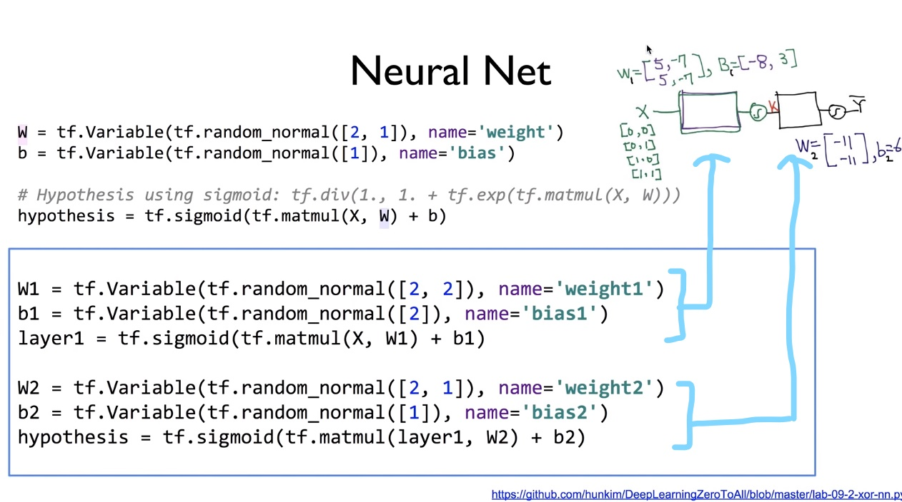

# Lab09-1. Neural Network for XOR - (2)

## Neural Network for XOR

    import tensorflow as tf
    import numpy as np
    
    tf.set_random_seed(777)  # for reproducibility
    
    x_data = np.array([[0, 0], [0, 1], [1, 0], [1, 1]], dtype=np.float32)
    y_data = np.array([[0], [1], [1], [0]], dtype=np.float32)
    
    X = tf.placeholder(tf.float32, [None, 2])
    Y = tf.placeholder(tf.float32, [None, 1])
    
    W1 = tf.Variable(tf.random_normal([2, 2]), name='weight1')
    b1 = tf.Variable(tf.random_normal([2]), name='bias1')
    layer1 = tf.sigmoid(tf.matmul(X, W1) + b1)
    
    W2 = tf.Variable(tf.random_normal([2, 1]), name='weight2')
    b2 = tf.Variable(tf.random_normal([1]), name='bias2')
    hypothesis = tf.sigmoid(tf.matmul(layer1, W2) + b2)
    
    # cost/loss function
    cost = - tf.reduce_mean(Y * tf.log(hypothesis) + (1 - Y) * tf.log(1 - hypothesis))
    train = tf.train.GradientDescentOptimizer(learning_rate=0.1).minimize(cost)
    
    # Accuracy computation
    # True if hypothesis > 0.5 else False
    predicted = tf.cast(hypothesis > 0.5, dtype=tf.float32)
    accuracy = tf.reduce_mean(tf.cast(tf.equal(predicted, Y), dtype=tf.float32))
    
    # Launch graph
    with tf.Session() as sess:
        # Initialize TensorFlow variables
        sess.run(tf.global_variables_initializer())
    
        for step in range(10001):
            sess.run(train, feed_dict={X: x_data, Y: y_data})
            if step % 100 == 0:
                print(step, sess.run(cost, feed_dict={X: x_data, Y: y_data}), sess.run([W1, W2]))
    
        # Accuracy report
        h, c, a = sess.run(
            [hypothesis, predicted, accuracy], feed_dict={X: x_data, Y: y_data}
        )
        print("\nHypothesis: ", h, "\nCorrect: ", c, "\nAccuracy: ", a)

[return]

0 0.7539022 [array([[ 0.7988674 ,  0.6801188 ],

[-1.2198634 , -0.30361032]], dtype=float32), array([[ 1.3752297 ],
       
[-0.78823847]], dtype=float32)]
       
100 0.69584423 [array([[ 0.671669  ,  0.71368533],

[-1.2917174 , -0.24467792]], dtype=float32), array([[ 1.1212678 ],

[-0.90971726]], dtype=float32)]
       
200 0.694039 [array([[ 0.64527303,  0.7046098 ],

[-1.318939  , -0.22392061]], dtype=float32), array([[ 1.0992552],
       
[-0.895172 ]], dtype=float32)]

. . .

9800 0.014252113 [array([[ 6.248434 ,  6.1034465],

[-6.371518 , -5.7972493]], dtype=float32), array([[10.046793],

[-9.544148]], dtype=float32)]

9900 0.014045564 [array([[ 6.2560105,  6.114064 ],

[-6.37964  , -5.808116 ]], dtype=float32), array([[10.073595],

[-9.571595]], dtype=float32)]

10000 0.013844791 [array([[ 6.263471 ,  6.1245112],

[-6.3876433, -5.818806 ]], dtype=float32), array([[10.100041],

[-9.598662]], dtype=float32)]

Hypothesis:  [[0.01338218]

 [0.98166394]
 
 [0.98809403]
 
 [0.01135799]] 
 
Correct:  [[0.]

 [1.]
 
 [1.]
 
 [0.]] 
 
Accuracy:  1.0

## Logistic Regression vs. Neural Network

    # In Logistic Regression,
    W = tf.Variable(tf.random_normal([2, 1]), name='weight')
    b = tf.Variable(tf.random_normal([1]), name='bias')
    hypothesis = tf.sigmoid(tf.matmul(X, W) + b)
    
    
    # In Neural Network,
    W1 = tf.Variable(tf.random_normal([2, 2]), name='weight1')
    b1 = tf.Variable(tf.random_normal([2]), name='bias1')
    layer1 = tf.sigmoid(tf.matmul(X, W1) + b1)
    
    W2 = tf.Variable(tf.random_normal([2, 1]), name='weight2')
    b2 = tf.Variable(tf.random_normal([1]), name='bias2')
    hypothesis = tf.sigmoid(tf.matmul(layer1, W2) + b2)
