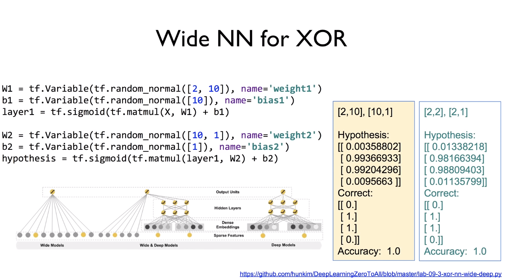

# Lab09-1. Neural Network for XOR - (3)

## Wide Neural Network for XOR

    import tensorflow as tf
    import numpy as np
    
    tf.set_random_seed(777)  # for reproducibility
    
    x_data = np.array([[0, 0], [0, 1], [1, 0], [1, 1]], dtype=np.float32)
    y_data = np.array([[0], [1], [1], [0]], dtype=np.float32)
    
    X = tf.placeholder(tf.float32, [None, 2])
    Y = tf.placeholder(tf.float32, [None, 1])
    
    W1 = tf.Variable(tf.random_normal([2, 10]), name='weight1')
    b1 = tf.Variable(tf.random_normal([10]), name='bias1')
    layer1 = tf.sigmoid(tf.matmul(X, W1) + b1)
    
    W2 = tf.Variable(tf.random_normal([10, 1]), name='weight2')
    b2 = tf.Variable(tf.random_normal([1]), name='bias2')
    hypothesis = tf.sigmoid(tf.matmul(layer1, W2) + b2)
    
    # cost/loss function
    cost = - tf.reduce_mean(Y * tf.log(hypothesis) + (1 - Y) * tf.log(1 - hypothesis))
    train = tf.train.GradientDescentOptimizer(learning_rate=0.1).minimize(cost)
    
    # Accuracy computation
    # True if hypothesis > 0.5 else False
    predicted = tf.cast(hypothesis > 0.5, dtype=tf.float32)
    accuracy = tf.reduce_mean(tf.cast(tf.equal(predicted, Y), dtype=tf.float32))
    
    # Launch graph
    with tf.Session() as sess:
        # Initialize TensorFlow variables
        sess.run(tf.global_variables_initializer())
    
        for step in range(10001):
            sess.run(train, feed_dict={X: x_data, Y: y_data})
            if step % 100 == 0:
                print(step, sess.run(cost, feed_dict={X: x_data, Y: y_data}), sess.run([W1, W2]))
    
        # Accuracy report
        h, c, a = sess.run(
            [hypothesis, predicted, accuracy], feed_dict={X: x_data, Y: y_data}
        )
        print("\nHypothesis: ", h, "\nCorrect: ", c, "\nAccuracy: ", a)

[return]

. . .

Hypothesis:  [[0.00358802]

 [0.99366933]

 [0.99204296]

 [0.00956631]] 

Correct:  [[0.]

 [1.]

 [1.]

 [0.]] 

Accuracy:  1.0

## Original vs. Wide

    # In Original version,
    # 2 -> (Neural1) - 2 -> (Neural2) -> 1
    W1 = tf.Variable(tf.random_normal([2, 2]), name='weight1')
    b1 = tf.Variable(tf.random_normal([2]), name='bias1')
    layer1 = tf.sigmoid(tf.matmul(X, W1) + b1)

    W2 = tf.Variable(tf.random_normal([2, 1]), name='weight2')
    b2 = tf.Variable(tf.random_normal([1]), name='bias')
    hypothesis = tf.sigmoid(tf.matmul(layer1, W2) + b2)
    
    # In Wide version,
    # 2 -> (Neural1) - 10 -> (Neural2) -> 1
    W1 = tf.Variable(tf.random_normal([2, 10]), name='weight1')
    b1 = tf.Variable(tf.random_normal([10]), name='bias1')
    layer1 = tf.sigmoid(tf.matmul(X, W1) + b1)
    
    W2 = tf.Variable(tf.random_normal([10, 1]), name='weight2')
    b2 = tf.Variable(tf.random_normal([1]), name='bias2')
    hypothesis = tf.sigmoid(tf.matmul(layer1, W2) + b2)
