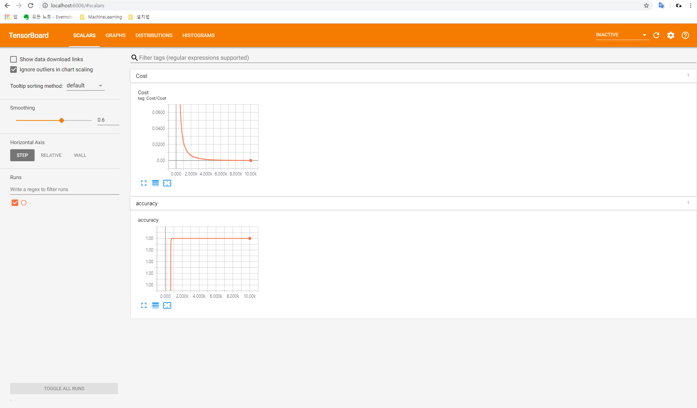
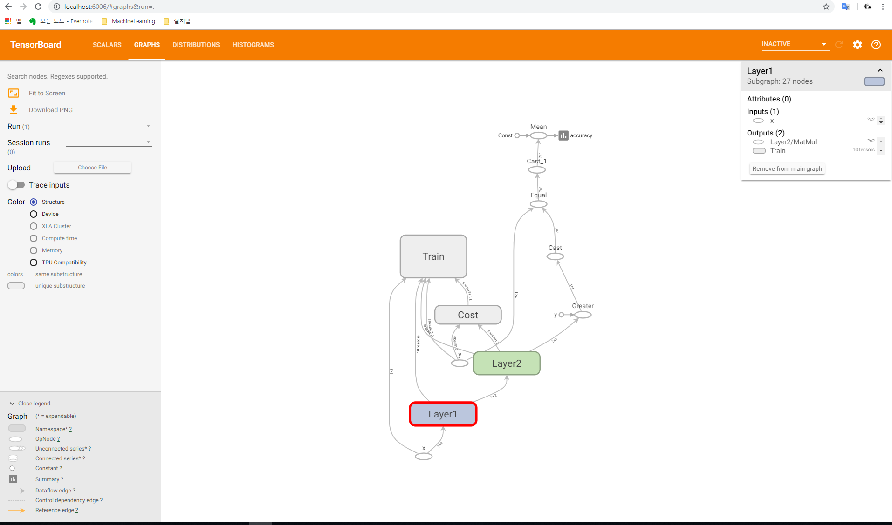
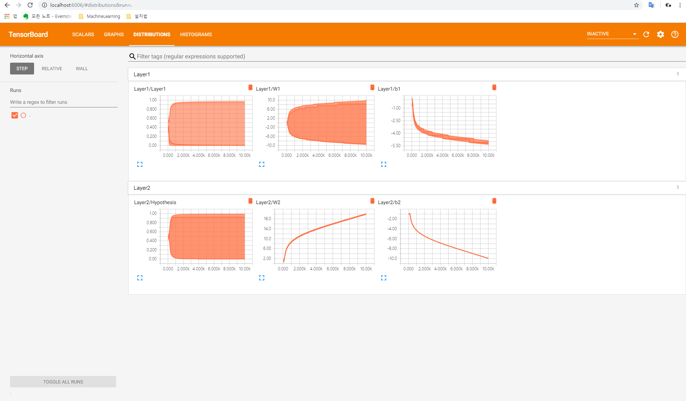
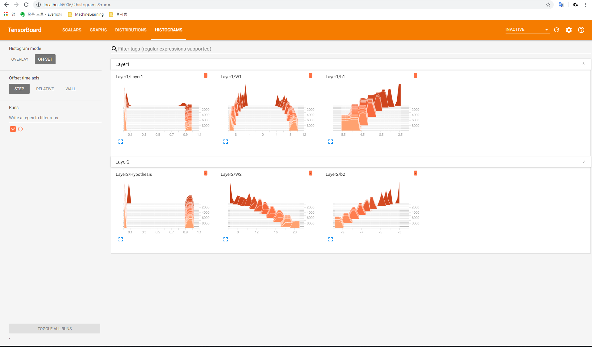

#Lab09-2. Meet TensorBoard

    import tensorflow as tf
    import numpy as np
    
    tf.set_random_seed(777)  # for reproducibility
    
    x_data = np.array([[0, 0], [0, 1], [1, 0], [1, 1]], dtype=np.float32)
    y_data = np.array([[0], [1], [1], [0]], dtype=np.float32)
    
    X = tf.placeholder(tf.float32, [None, 2], name="x")
    Y = tf.placeholder(tf.float32, [None, 1], name="y")
    
    # tf.name_scope(): grouping the graph logically
                       그래프를 논리적으로 그룹핑(grouping)
    with tf.name_scope("Layer1"):
        W1 = tf.Variable(tf.random_normal([2, 2]), name="weight_1")
        b1 = tf.Variable(tf.random_normal([2]), name="bias_1")
        layer1 = tf.sigmoid(tf.matmul(X, W1) + b1)
        
        # tf.summary.histogram(name, value): show the distribution of 'value'
                                             값에 대한 분포도를 보고자 할 때 사용, 다차원 텐서 사용 가능
        tf.summary.histogram("W1", W1)
        tf.summary.histogram("b1", b1)
        tf.summary.histogram("Layer1", layer1)
    
    with tf.name_scope("Layer2"):
        W2 = tf.Variable(tf.random_normal([2, 1]), name="weight_2")
        b2 = tf.Variable(tf.random_normal([1]), name="bias_2")
        hypothesis = tf.sigmoid(tf.matmul(layer1, W2) + b2)
    
        tf.summary.histogram("W2", W2)
        tf.summary.histogram("b2", b2)
        tf.summary.histogram("Hypothesis", hypothesis)
    
    # cost/loss function
    with tf.name_scope("Cost"):
        cost = -tf.reduce_mean(Y * tf.log(hypothesis) + (1 - Y) * tf.log(1 - hypothesis))
        # tf.summary.scalar(name, value): add a tensor in summary, only scalar data
                                          Summary에 추가할 텐서를 정의함, 다차원 행렬이 아닌 단일값을 가지는 Scalar 값만 가능
        tf.summary.scalar("Cost", cost)
    
    with tf.name_scope("Train"):
        train = tf.train.AdamOptimizer(learning_rate=0.01).minimize(cost)
    
    # Accuracy computation
    # True if hypothesis>0.5 else False
    predicted = tf.cast(hypothesis > 0.5, dtype=tf.float32)
    accuracy = tf.reduce_mean(tf.cast(tf.equal(predicted, Y), dtype=tf.float32))
    tf.summary.scalar("accuracy", accuracy)
    
    # Launch graph
    with tf.Session() as sess:
        # tensorboard --logdir="./logs/xor_logs"
        # if you have some error in Pycharm, move to './xor_logs_r0_01', try this command; tensorboard --logdir="."
        #
        # tf.summary.merge_all(): merge all summaries 모든 요약정보를 합치고 지정된 경로에 작성
        merged_summary = tf.summary.merge_all()
        // tf.summary.FileWriter(): set file save path
                                    지정된 경로에 생성된 파일들을 어디에 저장할 것인지 지정
        writer = tf.summary.FileWriter("./logs/xor_logs_r0_01")
        writer.add_graph(sess.graph)  # Show the graph
    
        # Initialize TensorFlow variables
        sess.run(tf.global_variables_initializer())
    
        for step in range(10001):
            _, summary, cost_val = sess.run(
                [train, merged_summary, cost], feed_dict={X: x_data, Y: y_data}
            )
            # add_summary(): write summary values in file each step
                             summary 값들을 기록함
            writer.add_summary(summary, global_step=step)
    
            if step % 100 == 0:
                print(step, cost_val)
    
        # Accuracy report
        h, p, a = sess.run(
            [hypothesis, predicted, accuracy], feed_dict={X: x_data, Y: y_data}
        )
    
        print(f"\nHypothesis:\n{h} \nPredicted:\n{p} \nAccuracy:\n{a}")

[return]

0 0.7168676

100 0.69085675

200 0.4987004

. . .

9800 6.4539025e-05

9900 6.136488e-05

10000 5.838447e-05

Hypothesis:

[[6.1310318e-05]

 [9.9993694e-01]
 
 [9.9995077e-01]
 
 [5.9751477e-05]] 
 
Predicted:

[[0.]

 [1.]
 
 [1.]
 
 [0.]] 
 
Accuracy:

1.0

## Show TensorBoard

    C:\User\. . .\xor_logs_r0_01> tensorboard --logdir="."
    . . .
    TensorBoard 1.12.2 at http://DESKTOP-*******:6006 (Press CTRL+C to quit)
    . . .

http://localhost:6006으로 접속하시면 TensorBoard를 보실 수 있습니다.

---

#### Scalars

---

#### Graphs

---

#### Distributions

---

#### Histograms

