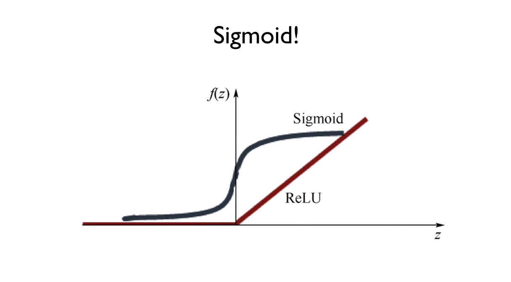
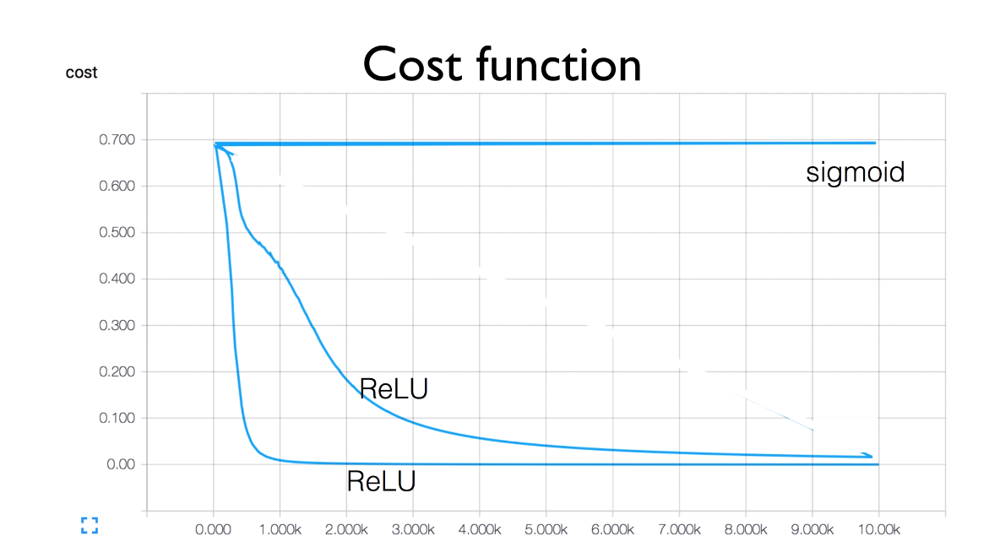

#Lab10. Improved NN Training - (1)

## ReLU

    import tensorflow as tf
    import matplotlib.pyplot as plt
    import random
    
    tf.set_random_seed(777)  # for reproducibility
    
    from tensorflow.examples.tutorials.mnist import input_data
    
    # Check out https://www.tensor-flow.org/get_started/mnist/beginners for
    # more information about the mnist dataset
    mnist = input_data.read_data_sets("MNIST_data/", one_hot=True)
    
    # parameters
    learning_rate = 0.001
    training_epoch = 15
    batch_size = 100
    
    nb_classes = 10
    
    # MNIST data image of shape 28 * 28 = 784
    X = tf.placeholder(tf.float32, [None, 784])
    # 0 - 9 digits recognition = 10 classes
    Y = tf.placeholder(tf.float32, [None, nb_classes])
    
    # weights & bias for nn layers
    W1 = tf.Variable(tf.random_normal([784, 256]), name='weight1')
    b1 = tf.Variable(tf.random_normal([256]), name='bias1')
    L1 = tf.nn.relu(tf.matmul(X, W1) + b1)
    
    W2 = tf.Variable(tf.random_normal([256, 256]), name='weight2')
    b2 = tf.Variable(tf.random_normal([256]), name='bias2')
    L2 = tf.nn.relu(tf.matmul(L1, W2) + b2)
    
    W3 = tf.Variable(tf.random_normal([256, nb_classes]), name='weight3')
    b3 = tf.Variable(tf.random_normal([nb_classes]), name='bias3')
    hypothesis = tf.matmul(L2, W3) + b3
    
    # define cost/loss & optimizer
    cost = tf.reduce_mean(tf.nn.softmax_cross_entropy_with_logits_v2(logits=hypothesis, labels=Y))
    optimizer = tf.train.AdamOptimizer(learning_rate=learning_rate).minimize(cost)
    
    # initialize
    sess = tf.Session()
    sess.run(tf.global_variables_initializer())
    
    # train my model
    for epoch in range(training_epoch):
        avg_cost = 0
        total_batch= int(mnist.train.num_examples / batch_size)
    
        for i in range(total_batch):
            batch_xs, batch_ys = mnist.train.next_batch(batch_size)
            feed_dict = {X: batch_xs, Y: batch_ys}
            c, _ = sess.run([cost, optimizer], feed_dict=feed_dict)
            avg_cost += c / total_batch
    
        print('Epoch:', '%04d' % (epoch + 1), 'cost=', '{:.9f}'.format(avg_cost))
    
    print("Learning finished!")
    
    # Test the model and check accuracy
    correct_prediction = tf.equal(tf.argmax(hypothesis, 1), tf.argmax(Y, 1))
    accuracy = tf.reduce_mean(tf.cast(correct_prediction, tf.float32))
    print('Accuracy:', sess.run(accuracy, feed_dict={X: mnist.test.images, Y: mnist.test.labels}))
    
    # Get one and predict
    r = random.randint(0, mnist.test.num_examples - 1)
    print("Label:", sess.run(tf.argmax(mnist.test.labels[r:r + 1], 1)))
    print("Prediction:", sess.run(tf.argmax(hypothesis, 1), feed_dict={X: mnist.test.images[r: r + 1]}),)
    
    # Show random MNIST image
    plt.imshow(
        mnist.test.images[r:r + 1].reshape(28, 28),
        cmap="Greys",
        interpolation="nearest",
    )
    plt.show()

[return]

Epoch: 0001 cost= 142.435877703

Epoch: 0002 cost= 38.927020280

Epoch: 0003 cost= 24.386520609

Epoch: 0004 cost= 16.854838913

Epoch: 0005 cost= 12.198336699

Epoch: 0006 cost= 9.148108485

Epoch: 0007 cost= 6.862091394

Epoch: 0008 cost= 5.080390849

Epoch: 0009 cost= 3.751601476

Epoch: 0010 cost= 2.896519461

Epoch: 0011 cost= 2.202559267

Epoch: 0012 cost= 1.656186669

Epoch: 0013 cost= 1.264444393

Epoch: 0014 cost= 0.983772296

Epoch: 0015 cost= 0.794967118

Learning finished!

Accuracy: 0.9433

Label: [3]

Prediction: [3]

## Original vs ReLU

    # Original
    L1 = tf.nn.softmax(tf.matmul(X, W1) + b1)
    
    # ReLU
    L1 = tf.nn.relu(tf.matmul(X, W1) + b1)

