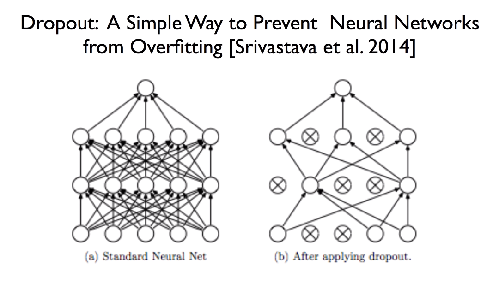

# Lab10. Improved NN Training - (4)

## Deep Neural Network with Dropout

    import tensorflow as tf
    import matplotlib.pyplot as plt
    import random
    
    tf.set_random_seed(777)  # for reproducibility
    
    from tensorflow.examples.tutorials.mnist import input_data
    
    # Check out https://www.tensor-flow.org/get_started/mnist/beginners for
    # more information about the mnist dataset
    mnist = input_data.read_data_sets("MNIST_data/", one_hot=True)
    
    # parameters
    learning_rate = 0.001
    training_epoch = 15
    batch_size = 100
    
    nb_classes = 10
    
    # MNIST data image of shape 28 * 28 = 784
    X = tf.placeholder(tf.float32, [None, 784])
    # 0 - 9 digits recognition = 10 classes
    Y = tf.placeholder(tf.float32, [None, nb_classes])
    
    # dropout (keep_prob) rate 0.7 on training, but should be 1 for testing
    # dropout rate는 training 중엔 주로 0.5~0.7을, testing이나 실사용중엔 반드시 1로 설정하여야 한다
    keep_prob = tf.placeholder(tf.float32)
    
    # weights & bias for nn layers
    W1 = tf.get_variable("W1", shape=[784, 512], initializer=tf.contrib.layers.xavier_initializer())
    b1 = tf.Variable(tf.random_normal([512]))
    L1 = tf.nn.relu(tf.matmul(X, W1) + b1)
    # tf.nn.dropout(<layer>, <keep_prob>): Dropout randomly some node
                                           랜덤하게 노드를 제외하여 훈련, keep_prob는 남길 노드의 비율을 의미
    L1 = tf.nn.dropout(L1, keep_prob=keep_prob)
    
    W2 = tf.get_variable("W2", shape=[512, 512], initializer=tf.contrib.layers.xavier_initializer())
    b2 = tf.Variable(tf.random_normal([512]))
    L2 = tf.nn.relu(tf.matmul(L1, W2) + b2)
    L2 = tf.nn.dropout(L2, keep_prob=keep_prob)
    
    W3 = tf.get_variable("W3", shape=[512, 512], initializer=tf.contrib.layers.xavier_initializer())
    b3 = tf.Variable(tf.random_normal([512]))
    L3 = tf.nn.relu(tf.matmul(L2, W3) + b3)
    L3 = tf.nn.dropout(L3, keep_prob=keep_prob)
    
    W4 = tf.get_variable("W4", shape=[512, 512], initializer=tf.contrib.layers.xavier_initializer())
    b4 = tf.Variable(tf.random_normal([512]))
    L4 = tf.nn.relu(tf.matmul(L3, W4) + b4)
    L4 = tf.nn.dropout(L4, keep_prob=keep_prob)
    
    W5 = tf.get_variable("W5", shape=[512, 10], initializer=tf.contrib.layers.xavier_initializer())
    b5 = tf.Variable(tf.random_normal([nb_classes]))
    hypothesis = tf.matmul(L4, W5) + b5
    
    # define cost/loss & optimizer
    cost = tf.reduce_mean(tf.nn.softmax_cross_entropy_with_logits_v2(logits=hypothesis, labels=Y))
    optimizer = tf.train.AdamOptimizer(learning_rate=learning_rate).minimize(cost)
    
    # initialize
    sess = tf.Session()
    sess.run(tf.global_variables_initializer())
    
    # train my model
    for epoch in range(training_epoch):
        avg_cost = 0
        total_batch = int(mnist.train.num_examples / batch_size)
    
        for i in range(total_batch):
            batch_xs, batch_ys = mnist.train.next_batch(batch_size)
            feed_dict = {X: batch_xs, Y: batch_ys, keep_prob: 0.7}
            c, _ = sess.run([cost, optimizer], feed_dict=feed_dict)
            avg_cost += c / total_batch
    
        print('Epoch:', '%04d' % (epoch + 1), 'cost=', '{:.9f}'.format(avg_cost))
    
    print("Learning finished!")
    
    # Test the model and check accuracy
    correct_prediction = tf.equal(tf.argmax(hypothesis, 1), tf.argmax(Y, 1))
    accuracy = tf.reduce_mean(tf.cast(correct_prediction, tf.float32))
    print('Accuracy:', sess.run(accuracy, feed_dict={X: mnist.test.images, Y: mnist.test.labels, keep_prob: 1}))
    
    # Get one and predict
    r = random.randint(0, mnist.test.num_examples - 1)
    print("Label:", sess.run(tf.argmax(mnist.test.labels[r:r + 1], 1)))
    print("Prediction:", sess.run(tf.argmax(hypothesis, 1), feed_dict={X: mnist.test.images[r: r + 1], keep_prob: 1}),)
    
    # Show random MNIST image
    plt.imshow(
        mnist.test.images[r:r + 1].reshape(28, 28),
        cmap="Greys",
        interpolation="nearest",
    )
    plt.show()

[return]

Epoch: 0001 cost= 0.451016781

Epoch: 0002 cost= 0.172922086

Epoch: 0003 cost= 0.127845718

Epoch: 0004 cost= 0.108389137

Epoch: 0005 cost= 0.093050506

Epoch: 0006 cost= 0.083469308

Epoch: 0007 cost= 0.075258198

Epoch: 0008 cost= 0.069615629

Epoch: 0009 cost= 0.063841542

Epoch: 0010 cost= 0.061475890

Epoch: 0011 cost= 0.058089914

Epoch: 0012 cost= 0.054294889

Epoch: 0013 cost= 0.048918156

Epoch: 0014 cost= 0.048411844

Epoch: 0015 cost= 0.046012261

Learning finished!

Accuracy: 0.9796

Label: [7]

Prediction: [7]

## Warning in Using Dropout

    # dropout (keep_prob) rate 0.7 on training, but should be 1 for testing
    # dropout rate는 training 중엔 주로 0.5~0.7을, testing이나 실사용중엔 반드시 1로 설정하여야 한다
    keep_prob = tf.placeholder(tf.float32)
    ...
    # training
    feed_dict = {X: batch_xs, Y: batch_ys, keep_prob: 0.7}
    ...
    # testing
    print('Accuracy:', sess.run(accuracy, feed_dict={X: mnist.test.images, Y: mnist.test.labels, keep_prob: 1}))
    ...
    # application
    print("Prediction:", sess.run(tf.argmax(hypothesis, 1), feed_dict={X: mnist.test.images[r: r + 1], keep_prob: 1}),)
