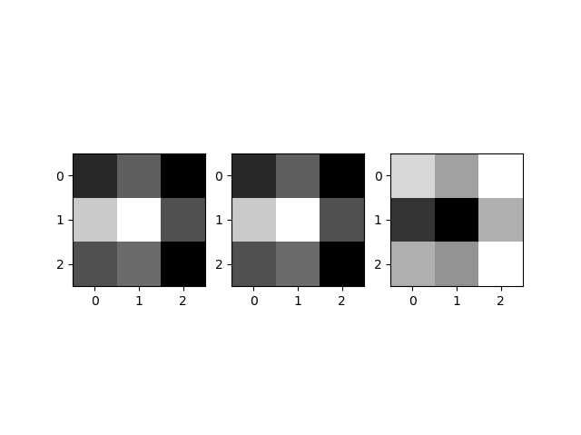

#Lab11-1. CNN Basics - (3)

## Basic CNN with 3 Filters

    import tensorflow as tf
    import numpy as np
    import matplotlib.pyplot as plt
    
    tf.set_random_seed(777)  # for reproducibility
    
    sess = tf.InteractiveSession()
    image = np.array([[[[1], [2], [3]],
                      [[4], [5], [6]],
                      [[7], [8], [9]]]], dtype=np.float32)
    print("image.shape", image.shape)
    # plt.imshow(image.reshape(3, 3), cmap='Greys')
    # plt.show()
    
    # 하나의 필터는 하나의 배열에 해당되는 것이 아니라,
    # 각 필터의 원소가 각각 배열에 하나씩 위치하게 됨
    # (2, 2, 1, 3) <= 마지막 숫자가 개수
    weight = tf.constant([[[[1., 10., -1.]], [[1., 10., -1.]]],
                          [[[1., 10., -1.]], [[1., 10., -1.]]]])
    print("weight.shape", weight.shape)
    conv2d = tf.nn.conv2d(image, weight, strides=[1, 1, 1, 1], padding='SAME')
    conv2d_img = conv2d.eval()
    print("conv2d_img.shape", conv2d_img.shape)
    conv2d_img = np.swapaxes(conv2d_img, 0, 3)
    for i, one_img in enumerate(conv2d_img):
        print(one_img.reshape(3, 3))
        plt.subplot(1, 3, i+1), plt.imshow(one_img.reshape(3, 3), cmap='gray')
    
    plt.show()
    
[return]

image.shape (1, 3, 3, 1)

weight.shape (2, 2, 1, 3)

conv2d_img.shape (1, 3, 3, 3)

[[12. 16.  9.]

 [24. 28. 15.]

 [15. 17.  9.]]

[[120. 160.  90.]

 [240. 280. 150.]

 [150. 170.  90.]]

[[-12. -16.  -9.]

 [-24. -28. -15.]

 [-15. -17.  -9.]]
 
 