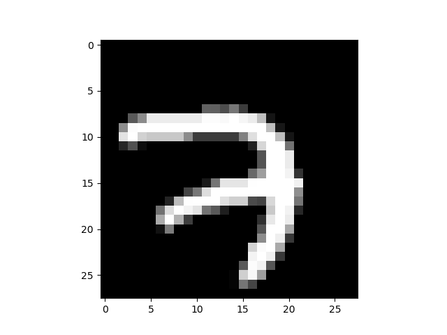
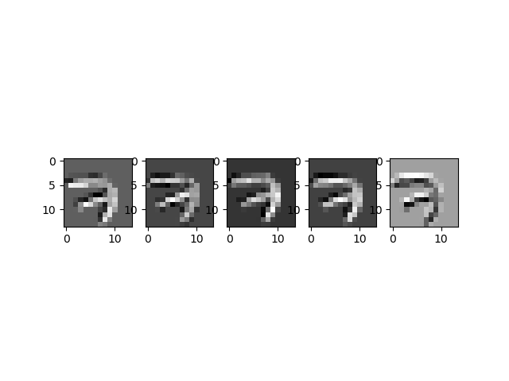
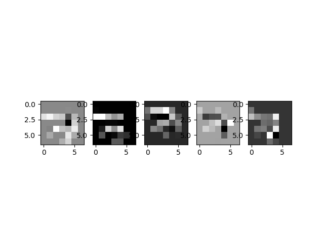

# Lab11-1. CNN Basics - (6)

## Simple CNN Example for MNIST

    import tensorflow as tf
    import numpy as np
    import matplotlib.pyplot as plt
    
    tf.set_random_seed(777)  # for reproducibility
    
    from tensorflow.examples.tutorials.mnist import input_data
    mnist = input_data.read_data_sets("MNIST_data/", one_hot=True)
    # Check out https://www.tensorflow.org/get_started/mnist/beginners for
    # more information about the mnist dataset
    
    img = mnist.train.images[0].reshape(28, 28)
    plt.imshow(img, cmap='gray')
    
    sess = tf.InteractiveSession()
    
    # img.reshape(): 여기서는 개수가 n개인 28*28*1 행렬 생성(-1은 미지정을 뜻함)
    # reshape(batch, width, height, channel)
    img = img.reshape(-1, 28, 28, 1)
    W1 = tf.Variable(tf.random_normal([3, 3, 1, 5], stddev=0.01))
    conv2d = tf.nn.conv2d(img, W1, strides=[1, 2, 2, 1], padding='SAME')
    print(conv2d)
    sess.run(tf.global_variables_initializer())
    conv2d_img = conv2d.eval()
    conv2d_img = np.swapaxes(conv2d_img, 0, 3)
    for i, one_img in enumerate(conv2d_img):
        plt.subplot(1, 5, i+1), plt.imshow(one_img.reshape(14, 14), cmap='gray')
    
    plt.show()
    
    pool = tf.nn.max_pool(conv2d, ksize=[1, 2, 2, 1], strides=[
                        1, 2, 2, 1], padding='SAME')
    print(pool)
    sess.run(tf.global_variables_initializer())
    pool_img = pool.eval()
    pool_img = np.swapaxes(pool_img, 0, 3)
    for i, one_img in enumerate(pool_img):
        plt.subplot(1, 5, i+1), plt.imshow(one_img.reshape(7, 7), cmap='gray')
    
    plt.show()

[return]

Tensor("Conv2D:0", shape=(1, 14, 14, 5), dtype=float32)

Tensor("MaxPool:0", shape=(1, 7, 7, 5), dtype=float32)

