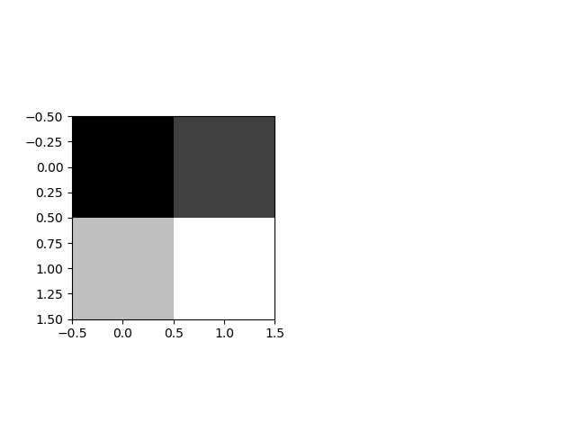

#Lab11-1. CNN Basics - (1)

## Basic CNN without Padding

- Input Image: 1개의 3X3X1 이미지(1은 색상을 뜻함)

- Filter: 1개의 2X2X1 필터, 다른 행렬은 맨 앞 숫자가 개수를 뜻하지만, 필터는 맨 뒤 숫자가 개수를 뜻함

- Stride: 행열 1씩 이동

    import numpy as np
    import matplotlib.pyplot as plt
    
    tf.set_random_seed(777)  # for reproducibility
    
    # tf.InteractiveSession(): 해당 세션이 기본 세션으로 설정되어,
                               각각의 tensor 실행 시, session 객체를 인자로 전달하지 않아도 됨
    sess = tf.InteractiveSession()
    image = np.array([[[[1], [2], [3]],
                      [[4], [5], [6]],
                      [[7], [8], [9]]]], dtype=np.float32)
    print("image.shape", image.shape)
    # plt.imshow(image.reshape(3, 3), cmap='Greys')
    # plt.show()
    
    weight = tf.constant([[[[1.]], [[1.]]],
                          [[[1.]], [[1.]]]])
    print("weight.shape", weight.shape)
    # tf.nn.conv2d(image, filter, strides, padding, ...): Convolution layer 설정
    # strides는 주로 중앙 2개의 값만을 사용,
    # 만약 2칸 움직이고 싶다면, strides=[1, 2, 2, 1]
    conv2d = tf.nn.conv2d(image, weight, strides=[1, 1, 1, 1], padding='VALID')
    conv2d_img = conv2d.eval()
    print("conv2d_img.shape", conv2d_img.shape)
    # np.swapaxes(): 행렬의 축 바꾸기(전치행렬로 만들기)
    conv2d_img = np.swapaxes(conv2d_img, 0, 3)
    # enumerate(): 해당 행렬의 각 원소의 인덱스와 원소 자체를 tuple로 반환함
    # 여기서는 conv2d_img에 있는 이미지를 각각 차례로 그려주기 위함
    for i, one_img in enumerate(conv2d_img):
        print(one_img.reshape(2, 2))
        plt.subplot(1, 2, i+1), plt.imshow(one_img.reshape(2, 2), cmap='gray')
    
    plt.show()
        
[return]

image.shape (1, 3, 3, 1)

weight.shape (2, 2, 1, 1)

conv2d_img.shape (1, 2, 2, 1)

[[12. 16.]

 [24. 28.]]
 
 
