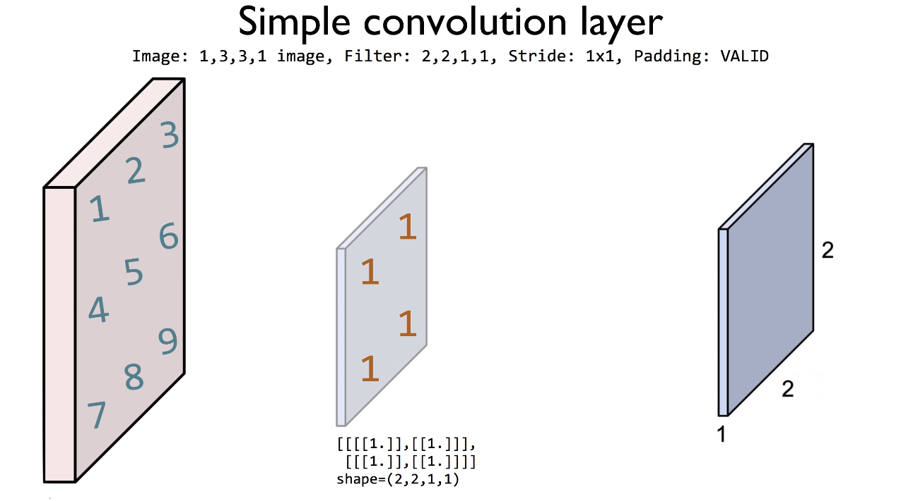
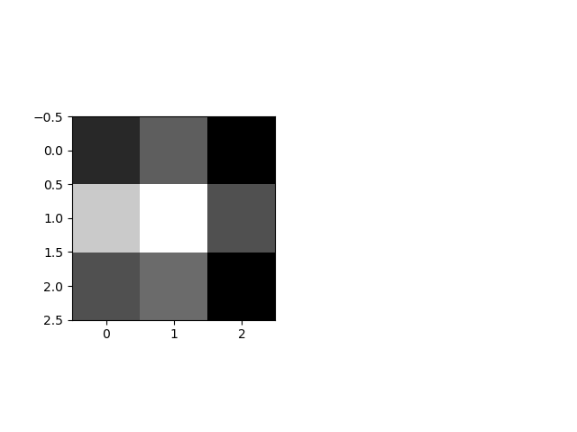

#Lab11-1. CNN Basics - (2)

## Basic CNN with Padding

    import numpy as np
    import matplotlib.pyplot as plt
    
    tf.set_random_seed(777)  # for reproducibility
    
    sess = tf.InteractiveSession()
    image = np.array([[[[1], [2], [3]],
                      [[4], [5], [6]],
                      [[7], [8], [9]]]], dtype=np.float32)
    print("image.shape", image.shape)
    # plt.imshow(image.reshape(3, 3), cmap='Greys')
    # plt.show()
    
    weight = tf.constant([[[[1.]], [[1.]]],
                          [[[1.]], [[1.]]]])
    print("weight.shape", weight.shape)
    # padding='SAME': Stride에 따라 출력이 입력의 크기과 같아지도록 자동으로 필요한 만큼 0으로 padding
    conv2d = tf.nn.conv2d(image, weight, strides=[1, 1, 1, 1], padding='SAME')
    conv2d_img = conv2d.eval()
    print("conv2d_img.shape", conv2d_img.shape)
    conv2d_img = np.swapaxes(conv2d_img, 0, 3)
    for i, one_img in enumerate(conv2d_img):
        print(one_img.reshape(3, 3))
        plt.subplot(1, 2, i+1), plt.imshow(one_img.reshape(3, 3), cmap='gray')
       
    plt.show()

        
[return]
image.shape (1, 3, 3, 1)

weight.shape (2, 2, 1, 1)

\conv2d_img.shape (1, 3, 3, 1)

[[12. 16.  9.]

 [24. 28. 15.]

 [15. 17.  9.]]
 
 
