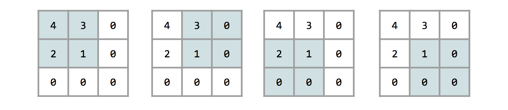

# Lab11-1. CNN Basics - (5)

## Max Pooling with Padding

    import tensorflow as tf
    import numpy as np

    tf.set_random_seed(777)  # for reproducibility

    sess = tf.InteractiveSession()
    image = np.array([[[[4], [3]],
                       [[2], [1]]]], dtype=np.float32)
    # tf.nn.max_pool(image, ksize, strides, padding): 이미지의 각 ksize 만큼에 대한 part에서 가장 큰 값을 찾아 pooling
    pool = tf.nn.max_pool(image, ksize=[1, 2, 2, 1],
                          strides=[1, 1, 1, 1], padding='SAME')

    print(pool.shape)
    print(pool.eval())

[return]

(1, 2, 2, 1)

[[[[4.]

   [3.]]

  [[2.]
  
   [1.]]]]