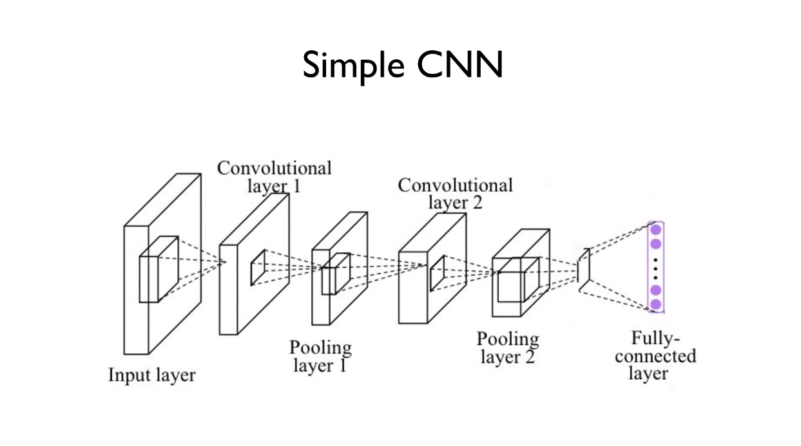
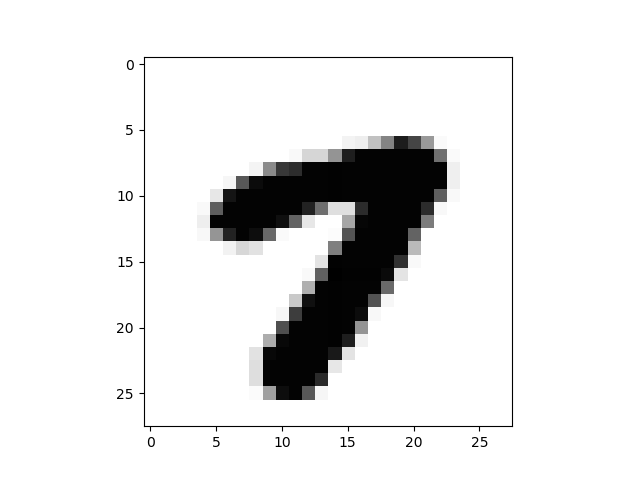

# Lab11-2. CNN for MNIST - (1)

## Simple CNN for MNIST

    import tensorflow as tf
    import random
    import matplotlib.pyplot as plt
    
    from tensorflow.examples.tutorials.mnist import input_data
    
    tf.set_random_seed(777)  # for reproducibility
    
    mnist = input_data.read_data_sets("MNIST_data/", one_hot=True)
    # Check out https://www.tensorflow.org/get_started/mnist/beginners for
    # more information about the mnist dataset
    
    # hyper parameters
    learning_rate = 0.001
    training_epochs = 15
    batch_size = 100
    
    # input place holders
    # 2차원 입력 X([이미지 개수, 각 이미지의 1차원 데이터]로 이루어진 배열)를
    # 4차원 이미지 형태로 변경 (Convolution을 위해)
    # 28*28*1의 3차원 이미지 N개로 이루어진 배열 생성됨
    X = tf.placeholder(tf.float32, [None, 784])
    X_img = tf.reshape(X, [-1, 28, 28, 1])  # img 28*28*1 (black/white)
    Y = tf.placeholder(tf.float32, [None, 10])
    
    # L1 ImgIn shape=(?, 28, 28, 1)
    W1 = tf.Variable(tf.random_normal([3, 3, 1, 32], stddev=0.01))
    #   Conv   -> (?, 28, 28, 32)
    #   Pool   -> (?, 14, 14, 32)
    L1 = tf.nn.conv2d(X_img, W1, strides=[1, 1, 1, 1], padding='SAME')
    L1 = tf.nn.relu(L1)
    L1 = tf.nn.max_pool(L1, ksize=[1, 2, 2, 1], strides=[1, 2, 2, 1], padding='SAME')
    
    # L2 ImgIn shape=(?, 14, 14, 32)
    W2 = tf.Variable(tf.random_normal([3, 3, 32, 64], stddev=0.01))
    #   Conv   -> (?, 14, 14, 64)
    #   Pool   -> (?, 7, 7, 64)
    L2 = tf.nn.conv2d(L1, W2, strides=[1, 1, 1, 1], padding='SAME')
    L2 = tf.nn.relu(L2)
    L2 = tf.nn.max_pool(L2, ksize=[1, 2, 2, 1], strides=[1, 2, 2, 1], padding='SAME')
    # Convolution layer와 pooling layer를 모두 거친 이미지를 2차원 배열로 다시 형태 변환 (FC를 위해)
    L2_flat = tf.reshape(L2, [-1, 7 * 7 * 64])
    
    # Final FC 7*7*64 inputs -> 10 outputs
    W3 = tf.get_variable("W3", shape=[7 * 7 * 64, 10], initializer=tf.contrib.layers.xavier_initializer())
    b = tf.Variable(tf.random_normal([10]))
    logits = tf.matmul(L2_flat, W3) + b
    
    # define cost/loss & optimizer
    cost = tf.reduce_mean(tf.nn.softmax_cross_entropy_with_logits_v2(logits=logits, labels=Y))
    optimizer = tf.train.AdamOptimizer(learning_rate=learning_rate).minimize(cost)
    
    # initialize
    sess = tf.Session()
    sess.run(tf.global_variables_initializer())
    
    # train my model
    print('Learning started. It takes sometime.')
    for epoch in range(training_epochs):
        avg_cost = 0
        total_batch = int(mnist.train.num_examples / batch_size)
    
        for i in range(total_batch):
            batch_xs, batch_ys = mnist.train.next_batch(batch_size)
            feed_dict = {X: batch_xs, Y: batch_ys}
            c, _ = sess.run([cost, optimizer], feed_dict=feed_dict)
            avg_cost += c / total_batch
    
        print('Epoch:', '%04d' % (epoch + 1), 'cost =', '{:.9f}'.format(avg_cost))
    
    print('Learning Finished!')
    
    # Test model and check accuracy
    correct_prediction = tf.equal(tf.argmax(logits, 1), tf.argmax(Y, 1))
    accuracy = tf.reduce_mean(tf.cast(correct_prediction, tf.float32))
    print('Accuracy:', sess.run(accuracy, feed_dict={X: mnist.test.images, Y: mnist.test.labels}))
    
    # Get one and predict
    r = random.randint(0, mnist.test.num_examples - 1)
    print("Label:", sess.run(tf.argmax(mnist.test.labels[r:r + 1], 1)))
    print("Prediction: ", sess.run(tf.argmax(logits, 1), feed_dict={X: mnist.test.images[r:r + 1]}))
    
    plt.imshow(mnist.test.images[r: r + 1].reshape(28, 28,), cmap='Greys', interpolation='nearest')
    plt.show()

[return]

Learning started. It takes sometime.

Epoch: 0001 cost = 0.345577185

Epoch: 0002 cost = 0.091736604

Epoch: 0003 cost = 0.068284046

Epoch: 0004 cost = 0.056339833

Epoch: 0005 cost = 0.047010720

Epoch: 0006 cost = 0.041194586

Epoch: 0007 cost = 0.036663712

Epoch: 0008 cost = 0.032757639

Epoch: 0009 cost = 0.027963868

Epoch: 0010 cost = 0.025047483

Epoch: 0011 cost = 0.022065875

Epoch: 0012 cost = 0.020263703

Epoch: 0013 cost = 0.016754853

Epoch: 0014 cost = 0.015507657

Epoch: 0015 cost = 0.013157484

Learning Finished!

Accuracy: 0.9883

Label: [7]

Prediction:  [7]

