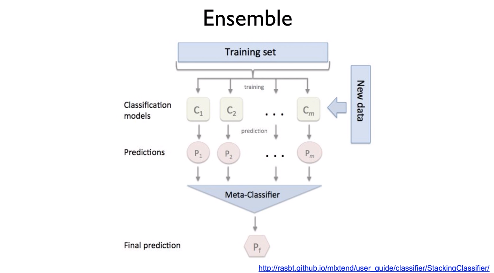
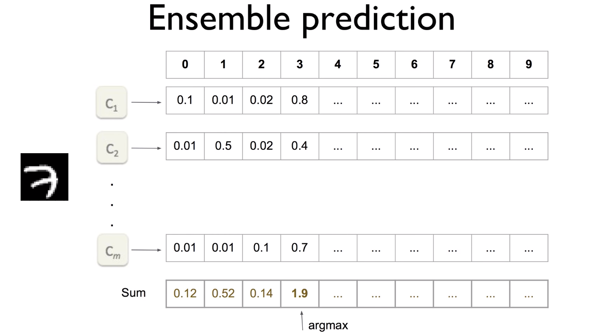

# Lab11-3. Improve Deep CNN - (3)

## Using Ensemble

    import tensorflow as tf
    import numpy as np

    from tensorflow.examples.tutorials.mnist import input_data

    tf.set_random_seed(777)  # for reproducibility

    mnist = input_data.read_data_sets("MNIST_data/", one_hot=True)
    # Check out https://www.tensorflow.org/get_started/mnist/beginners for
    # more information about the mnist dataset

    # hyper parameters
    learning_rate = 0.001
    training_epochs = 20
    batch_size = 100

    class Model:

        def __init__(self, sess, name):
            self.sess = sess
            self.name = name
            self._build_net()

        def _build_net(self):
            with tf.variable_scope(self.name):
                # dropout (keep_porb) rate 0.7~0.5 on training, but should be
                # for testing
                self.training = tf.placeholder(tf.bool)

                # input place holders
                self.X = tf.placeholder(tf.float32, [None, 784])

                # img 28*28*1 (black/white), Input Layer
                X_img = tf.reshape(self.X, [-1, 28, 28, 1])
                self.Y = tf.placeholder(tf.float32, [None, 10])

                # Convolustional Layer #1
                conv1 = tf.layers.conv2d(inputs=X_img, filters=32, kernel_size=[3, 3], padding="SAME", activation=tf.nn.relu)
                # Pooling Layer #1
                pool1 = tf.layers.max_pooling2d(inputs=conv1, pool_size=[2, 2], padding="SAME", strides=2)
                dropout1 = tf.layers.dropout(inputs=pool1, rate=0.3, training=self.training)

                # Convolutional Layer #2 and Pooling Layer #2
                conv2 = tf.layers.conv2d(inputs=dropout1, filters = 64, kernel_size=[3, 3], padding="SAME", activation=tf.nn.relu)
                pool2 = tf.layers.max_pooling2d(inputs=conv2, pool_size=[2, 2], padding="SAME", strides=2)
                dropout2 = tf.layers.dropout(inputs=pool2, rate=0.3, training=self.training)

                # Convolutional Layer #3 and Pooling Layer #3
                conv3 = tf.layers.conv2d(inputs=dropout2, filters=128, kernel_size=[3, 3], padding="SAME", activation=tf.nn.relu)
                pool3 = tf.layers.max_pooling2d(inputs=conv3, pool_size=[2, 2], padding="SAME", strides=2)
                dropout3 = tf.layers.dropout(inputs=pool3, rate=0.3, training=self.training)

                # Dense Layer with Relu
                flat = tf.reshape(dropout3, [-1, 128 * 4 * 4])
                dense4 = tf.layers.dense(inputs=flat, units=625, activation=tf.nn.relu)
                dropout4 = tf.layers.dropout(inputs=dense4, rate=0.5, training=self.training)

                # Logits (no activation) Layer: L5 Final FC 625 inputs -> 10 outputs
                self.logits = tf.layers.dense(inputs=dropout4, units=10)

            # define cost/loss & optimizer
            self.cost = tf.reduce_mean(tf.nn.softmax_cross_entropy_with_logits_v2(logits=self.logits, labels=self.Y))
            self.optimizer = tf.train.AdamOptimizer(learning_rate=learning_rate).minimize(self.cost)

            correct_prediction = tf.equal(tf.argmax(self.logits, 1), tf.argmax(self.Y, 1))
            self.accuracy = tf.reduce_mean(tf.cast(correct_prediction, tf.float32))

        def predict(self, x_test, training=False):
            return self.sess.run(self.logits, feed_dict={self.X: x_test, self.training: training})

        def get_accuracy(self, x_test, y_test, training=False):
            return self.sess.run(self.accuracy, feed_dict={self.X: x_test, self.Y: y_test, self.training: training})

        def train(self, x_data, y_data, training=True):
            return self.sess.run([self.cost, self.optimizer], feed_dict={self.X: x_data, self.Y: y_data, self.training: training})

    # initialize
    sess = tf.Session()

    # num_models 만큼의 model을 생성하여 models 리스트에 추가
    models = []
    num_models = 2
    for m in range(num_models):
        models.append(Model(sess, "model" + str(m)))

    sess.run(tf.global_variables_initializer())

    print('Learning Started!')

    # train my model
    for epoch in range(training_epochs):
        # model 수 만큼의 리스트 생성(cost를 각기 저장하기 위함)
        avg_cost_list = np.zeros(len(models))
        total_batch = int(mnist.train.num_examples / batch_size)
        for i in range(total_batch):
            batch_xs, batch_ys = mnist.train.next_batch(batch_size)

            # train each model
            # models 리스트에서 model을 하나씩 꺼내 학습
            for m_idx, m in enumerate(models):
                c, _ = m.train(batch_xs, batch_ys)
                # cost를 누적하여 각 model의 평균 cost를 구함
                avg_cost_list[m_idx] += c / total_batch

        print('Epoch:', '%04d' % (epoch + 1), 'cost =', avg_cost_list)

    print('Learning Finished!')

    # Test model and check accuracy
    # predictions: ensemble할 모델들의 예측치 합을 구하기 위해 test_size * 10(결과가 될 수 있는 경우 0~9)의 배열 생성
    test_size = len(mnist.test.labels)
    predictions = np.zeros([test_size, 10])
    # model을 한 개씩 test하여 각 test case에 대한 예측값을 predictions에 누적함
    for m_idx, m in enumerate(models):
        print(m_idx, 'Accuracy:', m.get_accuracy(mnist.test.images, mnist.test.labels))
        p = m.predict(mnist.test.images)
        predictions += p

    # prediction에서 가장 값이 큰 값이(ensemble models가 예측한 class가) 실제 label값과 동일한 지 확인
    ensemble_correct_prediction = tf.equal(tf.argmax(predictions, 1), tf.argmax(mnist.test.labels, 1))
    ensemble_accuracy = tf.reduce_mean(tf.cast(ensemble_correct_prediction, tf.float32))
    print('Ensemble accuracy:', sess.run(ensemble_accuracy))

[return]

Learning Started!

Epoch: 0001 cost = [0.28773236 0.28624799]

Epoch: 0002 cost = [0.08851634 0.09099287]

Epoch: 0003 cost = [0.06909378 0.0694102 ]

Epoch: 0004 cost = [0.05545676 0.05744249]

Epoch: 0005 cost = [0.04744492 0.04956733]

Epoch: 0006 cost = [0.0440832 0.0453921]

Epoch: 0007 cost = [0.04086506 0.04254192]

Epoch: 0008 cost = [0.03583682 0.03900334]

Epoch: 0009 cost = [0.03494026 0.03559827]

Epoch: 0010 cost = [0.03308821 0.03459014]

Epoch: 0011 cost = [0.03196919 0.03234637]

Epoch: 0012 cost = [0.02964943 0.03238253]

Epoch: 0013 cost = [0.02766215 0.02817363]

Epoch: 0014 cost = [0.02823663 0.02654646]

Epoch: 0015 cost = [0.02629715 0.02696222]

Epoch: 0016 cost = [0.02556414 0.02691113]

Epoch: 0017 cost = [0.02475909 0.02607233]

Epoch: 0018 cost = [0.02495878 0.02542796]

Epoch: 0019 cost = [0.02345744 0.02358451]

Epoch: 0020 cost = [0.02162881 0.0239577 ]

Learning Finished!

0 Accuracy: 0.9945

1 Accuracy: 0.9939

Ensemble accuracy: 0.9952